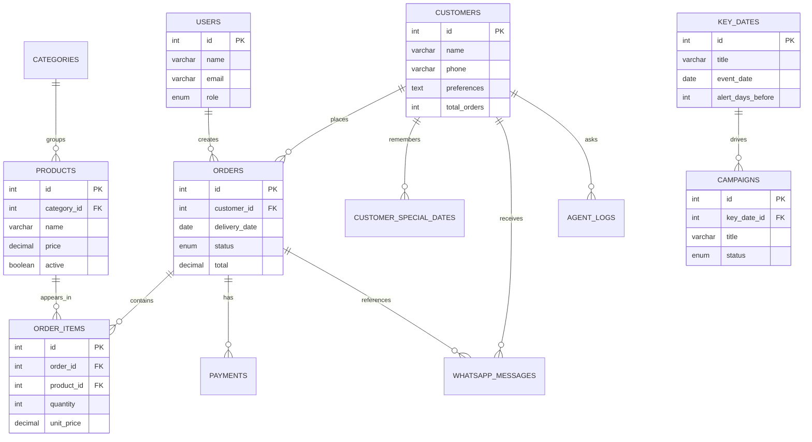

# Diagrama entidad-relación

```mermaid
erDiagram
  USERS ||--o{ ORDERS : creates
  CUSTOMERS ||--o{ ORDERS : places
  CUSTOMERS ||--o{ CUSTOMER_SPECIAL_DATES : remembers
  CATEGORIES ||--o{ PRODUCTS : groups
  PRODUCTS ||--o{ ORDER_ITEMS : appears_in
  ORDERS ||--o{ ORDER_ITEMS : contains
  ORDERS ||--o{ PAYMENTS : has
  KEY_DATES ||--o{ CAMPAIGNS : drives
  CUSTOMERS ||--o{ WHATSAPP_MESSAGES : receives
  ORDERS ||--o{ WHATSAPP_MESSAGES : references
  CUSTOMERS ||--o{ AGENT_LOGS : asks

  USERS {
    int id PK
    varchar name
    varchar email
    enum role
  }

  CUSTOMERS {
    int id PK
    varchar name
    varchar phone
    text preferences
    int total_orders
  }

  PRODUCTS {
    int id PK
    int category_id FK
    varchar name
    decimal price
    boolean active
  }

  ORDERS {
    int id PK
    int customer_id FK
    date delivery_date
    enum status
    decimal total
  }

  ORDER_ITEMS {
    int id PK
    int order_id FK
    int product_id FK
    int quantity
    decimal unit_price
  }

  KEY_DATES {
    int id PK
    varchar title
    date event_date
    int alert_days_before
  }

  CAMPAIGNS {
    int id PK
    int key_date_id FK
    varchar title
    enum status
  }
```
